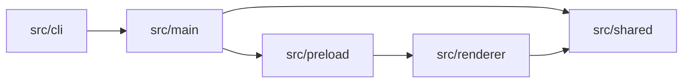
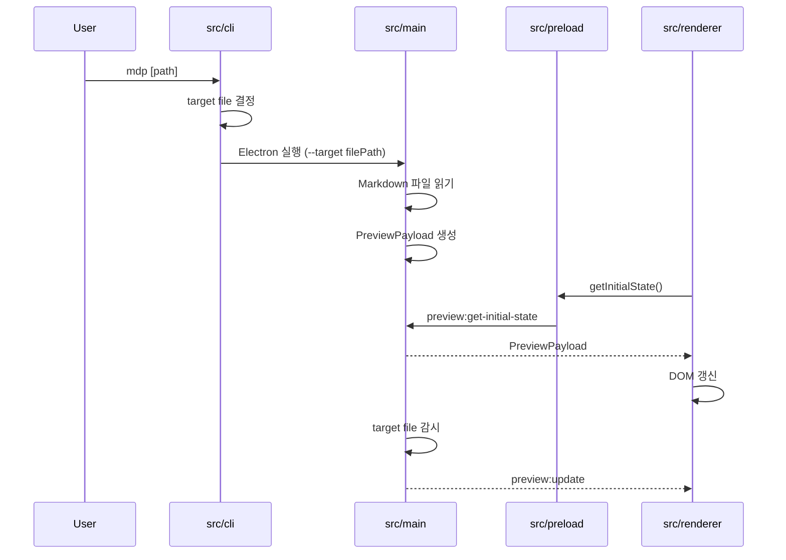

# Markdown Preview 구조와 동작 방식

이 문서는 `markdown-preview`의 코드 구조와 실행 경계만 설명합니다.

## 전체 구조



| 경로 | 책임 |
| --- | --- |
| `src/cli` | CLI 인자 처리, Markdown 파일 선택, Electron 실행 |
| `src/main` | Electron main process, 파일 읽기, 창 생성, IPC, 파일 감시 |
| `src/preload` | renderer에 노출할 제한된 bridge API 정의 |
| `src/renderer` | preview DOM 갱신, Mermaid SVG 렌더링, 스타일 적용 |
| `src/shared` | 공용 타입, 설정, runtime path, Markdown 변환 |
| `scripts` | build/dev 실행 스크립트 |
| `bin` | 패키지 CLI wrapper |
| `test` | 계층별 동작 검증 |

## 실행 흐름



런타임의 중심 데이터는 `PreviewPayload`입니다. main process가 파일 시스템과
Markdown 변환을 담당하고, renderer는 preload bridge를 통해 payload만 받아
화면을 갱신합니다.

## CLI 계층

진입점은 `src/cli/index.ts`입니다.

| 파일 | 책임 |
| --- | --- |
| `src/cli/index.ts` | target 선택 후 Electron main process 실행 |
| `src/cli/resolve-target.ts` | 인자 0개 또는 1개를 파일/디렉터리 target으로 해석 |
| `src/cli/scan-markdown-files.ts` | 디렉터리에서 `.md` 파일 재귀 탐색 |
| `src/cli/fzf-candidates.ts` | `fzf` label과 실제 파일 경로 매핑 |
| `src/cli/run-fzf.ts` | `fzf` subprocess 실행 결과를 typed result로 변환 |

CLI target 결정 규칙은 다음과 같습니다.

1. 인자가 없으면 현재 작업 디렉터리를 target으로 사용합니다.
2. target이 파일이면 바로 preview 대상으로 사용합니다.
3. target이 디렉터리면 `.md` 파일을 찾고 `fzf`로 하나를 선택합니다.
4. `.git`, `node_modules`, 숨김 디렉터리는 Markdown 탐색에서 제외합니다.
5. `fzf` 선택 취소는 정상 종료로 처리합니다.

파일 target이 결정되면 CLI는 Electron 실행 파일을 spawn하고
`dist/main/index.js --target <filePath>`를 전달합니다.

## Main Process 계층

진입점은 `src/main/index.ts`입니다.

| 파일 | 책임 |
| --- | --- |
| `src/main/index.ts` | app bootstrap, payload 생성, watcher/IPC 연결 |
| `src/main/create-window.ts` | `BrowserWindow` 생성과 navigation 정책 |
| `src/main/ipc.ts` | initial state handler와 update sender |
| `src/main/watch-file.ts` | target file 변경 감시와 debounce |

`src/main/index.ts`의 bootstrap 순서는 다음과 같습니다.

1. `--target` 인자를 절대 경로로 해석합니다.
2. `app.whenReady()` 이후 설정을 로드합니다.
3. `createWindow()`로 preview window를 만듭니다.
4. `buildPreviewPayload()`로 초기 payload를 만듭니다.
5. `registerPreviewIpc()`로 renderer의 initial state 요청을 연결합니다.
6. `watchFile()`로 target file을 감시합니다.
7. 파일 변경 시 payload를 다시 만들고 `sendPreviewUpdate()`로 전송합니다.
8. window close 시 watcher와 IPC handler를 해제합니다.

`buildPreviewPayload()`는 파일 읽기, Markdown 변환, preferences 매핑을 수행합니다.
파일 읽기나 변환이 실패하면 renderer로 error HTML payload를 보냅니다.

## Window와 보안 경계

`src/main/create-window.ts`는 Electron window 경계를 정의합니다.

- `contextIsolation: true`
- `nodeIntegration: false`
- preload script 사용
- `loadFile()`로 `dist/renderer/index.html` 로드
- `ready-to-show` 이후 window 표시

navigation 정책은 다음과 같습니다.

- preview 내부 navigation은 항상 차단합니다.
- `http:`와 `https:` URL만 `shell.openExternal()`로 외부 브라우저에서 엽니다.
- `file:`, `javascript:` 등은 외부로도 열지 않습니다.

## Preload와 IPC

IPC channel과 payload 타입은 `src/shared/types.ts`에 있습니다.

| 이름 | 용도 |
| --- | --- |
| `preview:get-initial-state` | renderer 초기 payload 요청 |
| `preview:update` | 파일 변경 후 payload push |
| `PreviewPayload` | renderer가 화면 갱신에 사용하는 데이터 |
| `PreviewApi` | preload가 renderer에 노출하는 API |

`src/preload/index.ts`는 renderer에 다음 API만 노출합니다.

```ts
window.previewBridge.getInitialState();
window.previewBridge.onPreviewUpdate((payload) => {});
```

renderer는 Electron IPC 객체를 직접 사용하지 않습니다.

## Renderer 계층

renderer entrypoint는 `src/renderer/index.ts`입니다.

| 파일 | 책임 |
| --- | --- |
| `src/renderer/index.html` | preview shell markup |
| `src/renderer/index.ts` | initial state 요청과 update subscription |
| `src/renderer/render-preview.ts` | payload를 DOM과 CSS 변수에 반영 |
| `src/renderer/render-mermaid.ts` | Mermaid placeholder를 SVG로 변환 |
| `src/renderer/preview.css` | Markdown preview와 Mermaid block 스타일 |

renderer bootstrap 순서는 다음과 같습니다.

1. `window.previewBridge.getInitialState()`로 초기 payload를 가져옵니다.
2. `renderPreview(payload)`로 title, file path, preview HTML, CSS 변수를 갱신합니다.
3. `onPreviewUpdate()`로 이후 payload를 구독합니다.
4. HTML 삽입 후 `renderMermaidBlocks()`를 실행합니다.

## Shared 계층

| 파일 | 책임 |
| --- | --- |
| `src/shared/types.ts` | IPC channel, payload, bridge API 타입 |
| `src/shared/config.ts` | TOML 설정 로딩, 기본값, CSS font value 변환 |
| `src/shared/runtime-path.ts` | built entrypoint 기준 sibling artifact 경로 해석 |
| `src/shared/markdown/render-markdown.ts` | Markdown source를 preview HTML로 변환 |
| `src/shared/markdown/extract-mermaid-blocks.ts` | Mermaid fence 판별과 source encode/decode |

## Markdown 변환 경계

Markdown 변환은 main process에서 수행됩니다.

`src/shared/markdown/render-markdown.ts`는 `markdown-it`을 사용하고 다음 renderer
rule을 추가합니다.

- `mermaid` fenced code block을 renderer용 placeholder HTML로 변환합니다.
- table을 `.table-scroll` wrapper로 감쌉니다.
- raw HTML은 allowlist를 통과한 태그만 유지합니다.
- allowlist 밖 HTML은 escape합니다.

허용되는 raw HTML 범위는 다음과 같습니다.

| 범위 | 태그 |
| --- | --- |
| inline | `br`, `img`, `kbd`, `sub`, `sup`, `summary` |
| block | `details`와 inline allowlist 전체 |

`img`는 `src`, `alt`, `title`, `width`, `height`만 허용합니다. `src`는 `http://`,
`https://`, `file://`만 허용합니다.

## Mermaid 렌더링 경계

Mermaid source는 Markdown 변환 단계에서 placeholder의 `data-mermaid-source`에
저장됩니다. 실제 SVG 렌더링은 renderer process에서 수행됩니다.

`src/renderer/render-mermaid.ts`의 처리 순서는 다음과 같습니다.

1. Mermaid를 `securityLevel: "strict"`, `startOnLoad: false`로 초기화합니다.
2. `[data-mermaid-source]` element를 찾습니다.
3. source를 decode합니다.
4. `mermaid.render()`로 SVG를 생성합니다.
5. 성공 시 `.mermaid-diagram`에 SVG를 넣습니다.
6. 실패 시 `.mermaid-error`에 오류 메시지를 표시합니다.

## 설정 구조

설정 파일은 `~/.config/markdown-preview/config.toml`입니다.

`src/shared/config.ts`는 다음 값을 로드합니다.

| key | payload/window 반영 위치 |
| --- | --- |
| `font-family` | renderer CSS 변수 |
| `font-size` | renderer CSS 변수 |
| `monospace-font-family` | renderer CSS 변수 |
| `monospace-font-size` | renderer CSS 변수 |
| `width` | `BrowserWindow` width |
| `height` | `BrowserWindow` height |

설정 파일이 없으면 기본 설정 파일을 생성합니다. 잘못된 값이나 파싱 실패는
기본값으로 대체합니다.

## 빌드 구조

`scripts/build.ts`는 `dist`를 다시 만들고 네 entrypoint를 개별 bundle로 빌드합니다.

| entrypoint | output | target | format | external |
| --- | --- | --- | --- | --- |
| `src/cli/index.ts` | `dist/cli` | `node` | `cjs` | `electron` |
| `src/main/index.ts` | `dist/main` | `node` | `cjs` | `electron` |
| `src/preload/index.ts` | `dist/preload` | `node` | `cjs` | `electron` |
| `src/renderer/index.ts` | `dist/renderer` | `browser` | `esm` | 없음 |

정적 renderer asset은 복사됩니다.

```text
src/renderer/index.html -> dist/renderer/index.html
src/renderer/preview.css -> dist/renderer/preview.css
```

runtime path는 `process.argv[1]`인 built entrypoint 위치를 기준으로 계산합니다.
따라서 `dist/cli`, `dist/main`, `dist/preload`, `dist/renderer`의 상대 배치가
실행 구조의 일부입니다.

## 테스트 구조

테스트는 코드 계층과 같은 단위로 나뉩니다.

| 테스트 경로 | 검증 경계 |
| --- | --- |
| `test/cli` | target 해석, Markdown 탐색, `fzf` 결과 처리 |
| `test/main` | window 생성 정책, navigation 차단, file watch debounce |
| `test/shared` | config, runtime path, Markdown 변환, Mermaid source encode/decode |
| `test/renderer` | payload DOM 반영, Mermaid 렌더링, preview CSS |
| `test/package-cli.test.ts` | `mdp` package entrypoint |
