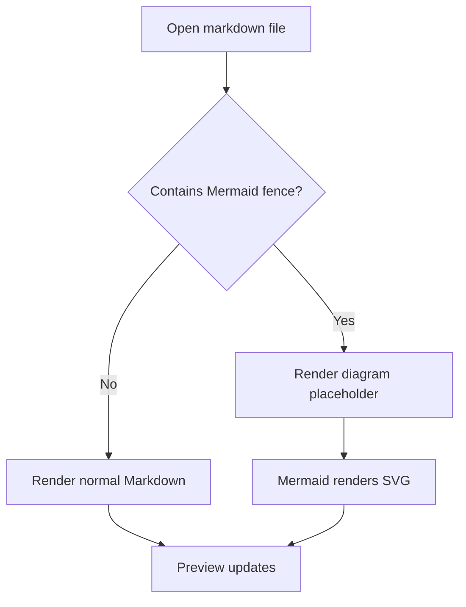
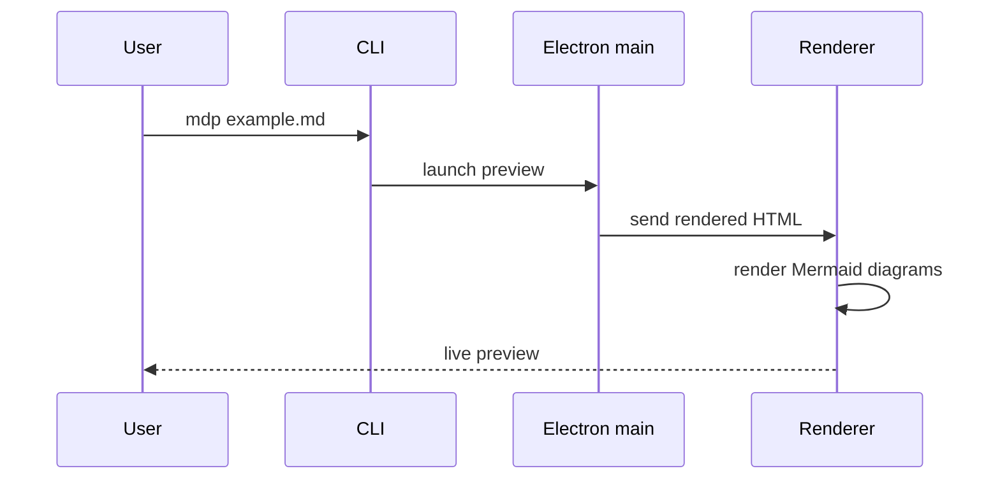
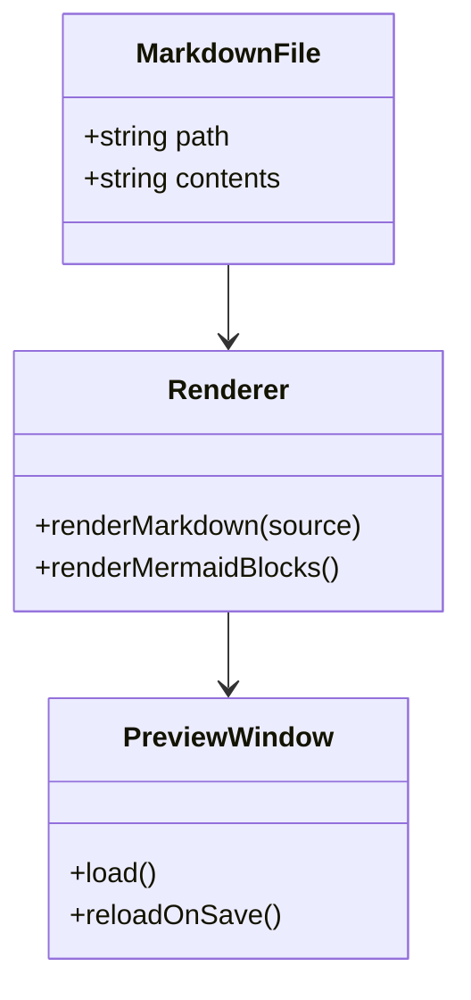
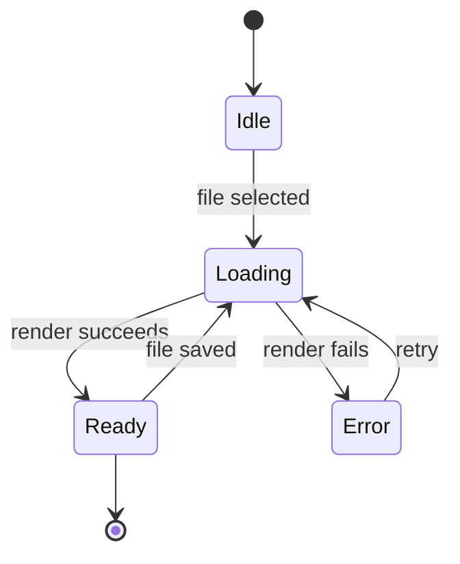
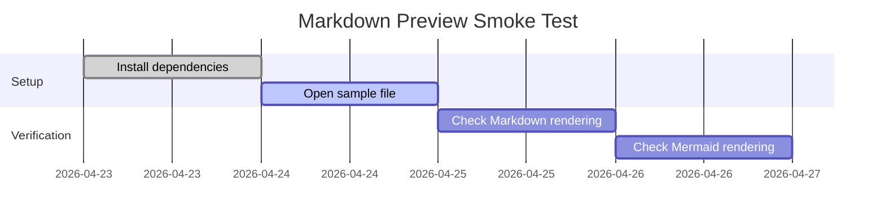
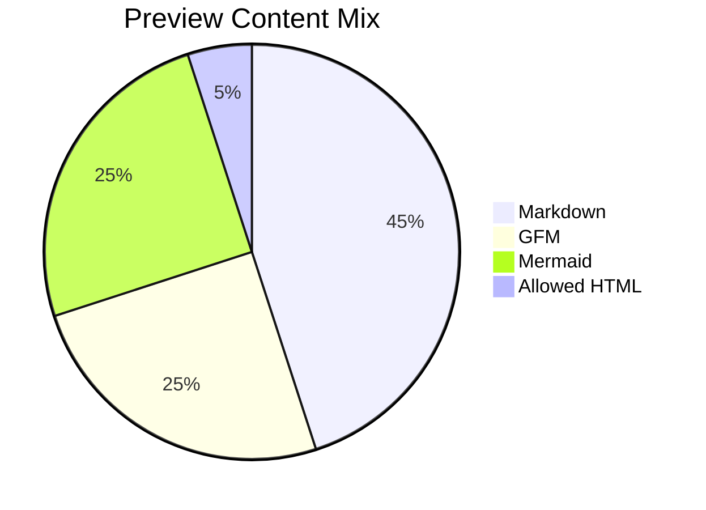
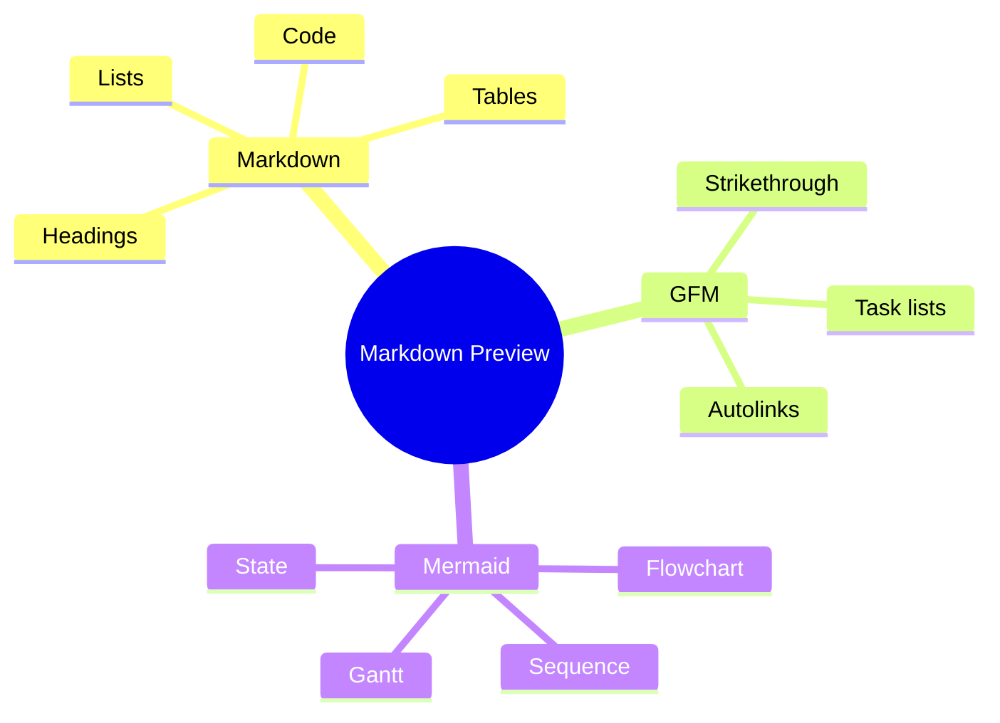
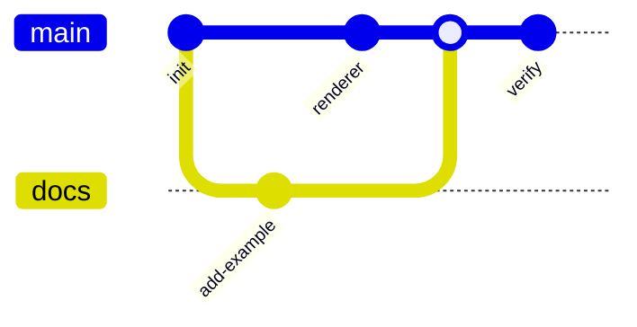

# Markdown Preview Kitchen Sink

Use this file to exercise common Markdown, GitHub Flavored Markdown patterns,
allowed inline HTML, code fences, and Mermaid diagrams.

```bash
bun run dev -- example.md
```

## Text

# Heading 1

## Heading 2

### Heading 3

Regular paragraph text can include **bold**, _italic_, ***bold italic***,
~~strikethrough~~, `inline code`, and a soft line break  
before this line.

Hard line break with HTML:<br>
H<sub>2</sub>O, x<sup>2</sup>, and <kbd>Cmd</kbd> + <kbd>K</kbd>.

Visit https://example.com or read [the README](README.md).

> A blockquote can contain **formatting** and nested structure.
>
> - quoted list item
> - another quoted list item

---

## Lists

- unordered item
- unordered item with nested details
  - nested item
  - nested item with `code`
- unordered item after nesting

1. ordered item
2. ordered item with nested content
   1. nested ordered item
   2. nested ordered item
3. ordered item after nesting

GFM-style task list:

- [x] Render Markdown
- [x] Replace Mermaid fences with preview placeholders
- [ ] Confirm task-list checkbox rendering behavior

Definition-style text:

Term
: Description line that should remain readable even if definition lists are not
  specially rendered.

## Table

| Feature | Markdown | Expected preview surface |
| --- | :---: | --- |
| Emphasis | `**bold**` and `_italic_` | Inline formatting |
| Strikethrough | `~~removed~~` | GFM-style deletion |
| Table alignment | `:---:` | Center alignment for this column |
| Long content | This cell intentionally contains enough text to test horizontal scrolling, wrapping, and readable table spacing in a preview window. | No layout break |

## Code

Inline TypeScript:

```ts
type PreviewState = "idle" | "loading" | "ready" | "error";

function renderLabel(filePath: string, state: PreviewState) {
    return `${state.toUpperCase()}: ${filePath}`;
}
```

JSON:

```json
{
    "name": "markdown-preview",
    "features": ["markdown", "gfm", "mermaid"]
}
```

JavaScript:

```js
const files = ["README.md", "example.md", "docs/architecture.md"];
const markdownFiles = files.filter((file) => file.endsWith(".md"));

console.log(`Found ${markdownFiles.length} markdown files.`);
```

Python:

```python
from pathlib import Path

markdown_files = sorted(Path(".").glob("*.md"))

for file_path in markdown_files:
    print(f"{file_path.name}: {file_path.stat().st_size} bytes")
```

Java:

```java
import java.nio.file.Path;
import java.util.List;

public class PreviewQueue {
    private final List<Path> files;

    public PreviewQueue(List<Path> files) {
        this.files = files;
    }

    public int size() {
        return files.size();
    }
}
```

Rust:

```rust
fn render_status(file: &str, ready: bool) -> String {
    match ready {
        true => format!("{file} is ready"),
        false => format!("{file} is loading"),
    }
}

fn main() {
    println!("{}", render_status("example.md", true));
}
```

Go:

```go
package main

import "fmt"

func renderStatus(file string, ready bool) string {
	if ready {
		return fmt.Sprintf("%s is ready", file)
	}

	return fmt.Sprintf("%s is loading", file)
}
```

## Allowed HTML

<details>
<summary>Click to expand details</summary>

The renderer allows practical disclosure content and keeps it readable in the
preview.

</details>

Safe image tag:


Unsupported raw HTML should be escaped rather than executed:

<script>alert("this should not run")</script>

## Mermaid: Flowchart



## Mermaid: Sequence



## Mermaid: Class Diagram



## Mermaid: State Diagram



## Mermaid: Gantt



## Mermaid: Pie



## Mermaid: Mindmap



## Mermaid: Git Graph


